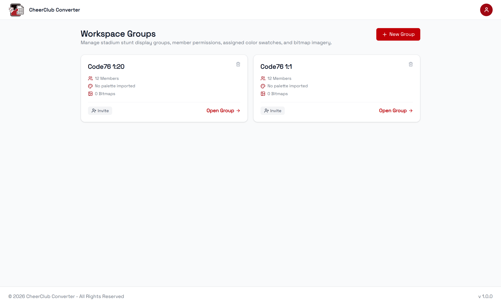
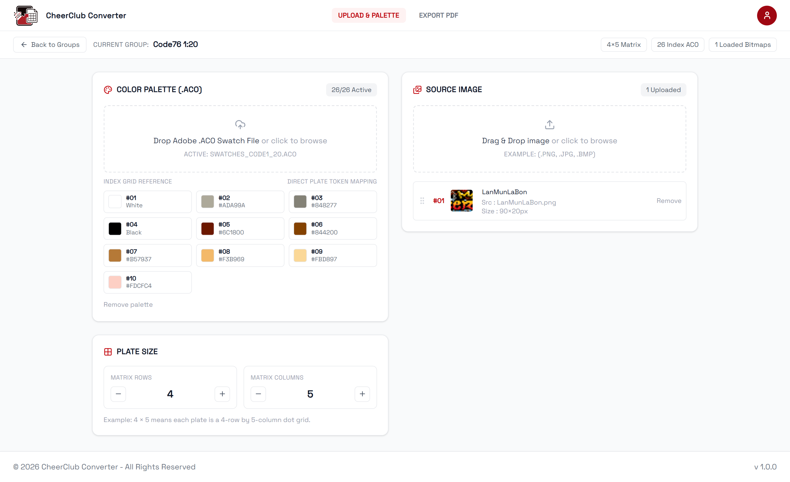
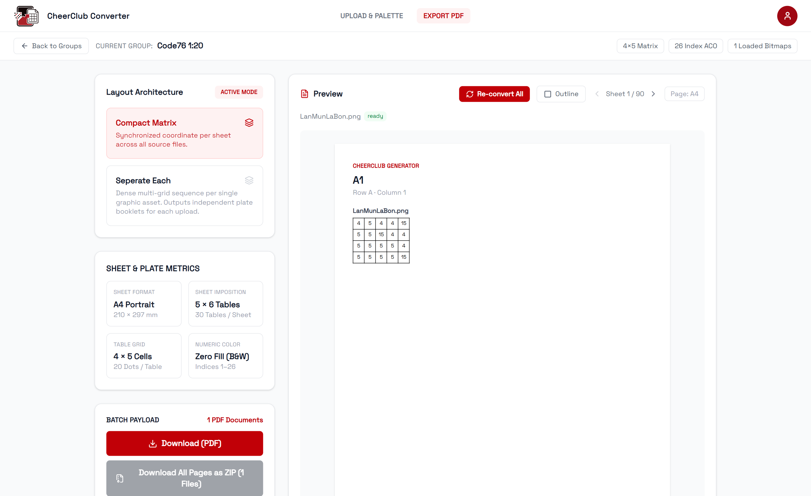
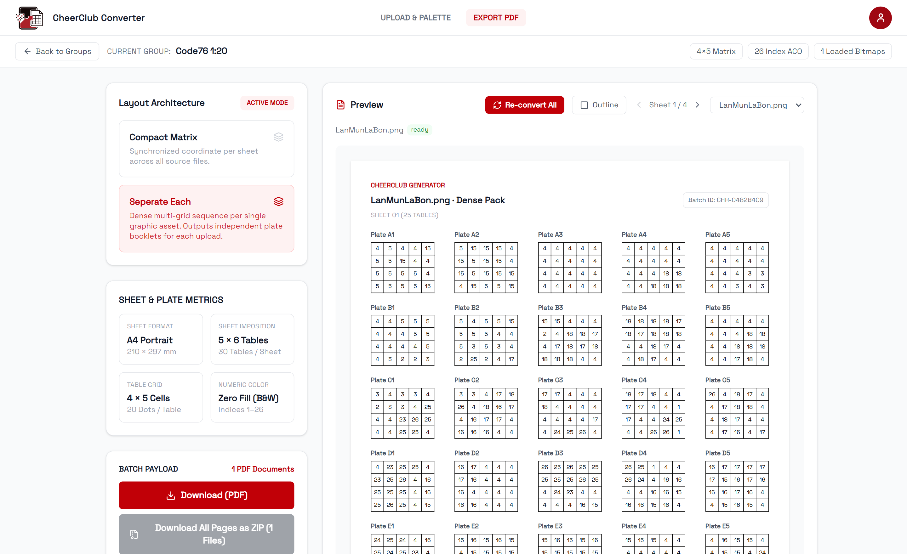

# 🎉 CheerClub Converter

  

  
  
  

## ✨ Overview

**CheerClub Converter** is a web application designed to make creating **แปรอักษร (Cheer Code)** sheets easier and faster.

Simply upload an image of your cheer design and convert it into a **print-ready PDF template** for use during rehearsals and performances.

No more manually recreating grids or preparing templates from scratch — **upload, convert**

## 🚀 Features

| Feature               | Description                                                          |
| --------------------- | -------------------------------------------------------------------- |
| **Image to Template** | Convert a cheer design image into a structured template.             |
| **PDF Export**        | Generate a printable PDF for use during rehearsals and performances. |
| **Grid Generation**   | Automatically create a grid layout based on the uploaded design.     |

## 📥 Getting Started

Try CheerClub Converter online:

**https://cheerclub-converter.vercel.app/**
## 🖥 Built With

<table>
<tr align="center">
  <td width="100">
    
  </td>
  <td width="100">
    
  </td>
  <!-- <td width="100">
    
  </td> -->
  <td width="100">
    
  </td>
</tr>
<tr align="center">
  <td>React</td>
  <td>Tailwind</td>
  <!-- <td>Supabase</td> -->
  <td>Vercel</td>
</tr>
</table>

## 📸 Screenshots

<table>
<tr>
<td align="center">
  
   <b>Group Management</b>
</td>
<td align="center">
  
   <b>Upload & Palette</b>
</td>
</tr>
<tr>
<td align="center">
  
   <b>Compact Matrix</b>
</td>
<td align="center">
  
   <b>Seperate Each</b>
</td>
</tr>
</table>

## 🎯 Use Cases

CheerClub Converter can be used for:
* 🎉 Sports days
* 🎉 Jaturamitr
* 🎉 CUTU

## ⭐ Support

If CheerClub Converter helps you prepare for your next performance, consider giving this repository a ⭐.

It helps support future development and makes the project easier for others to discover.

## 📄 License

This project is licensed under the [MIT License](LICENSE).
